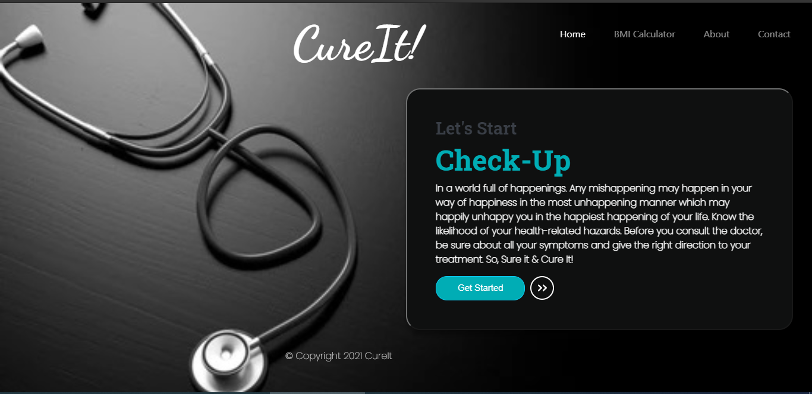
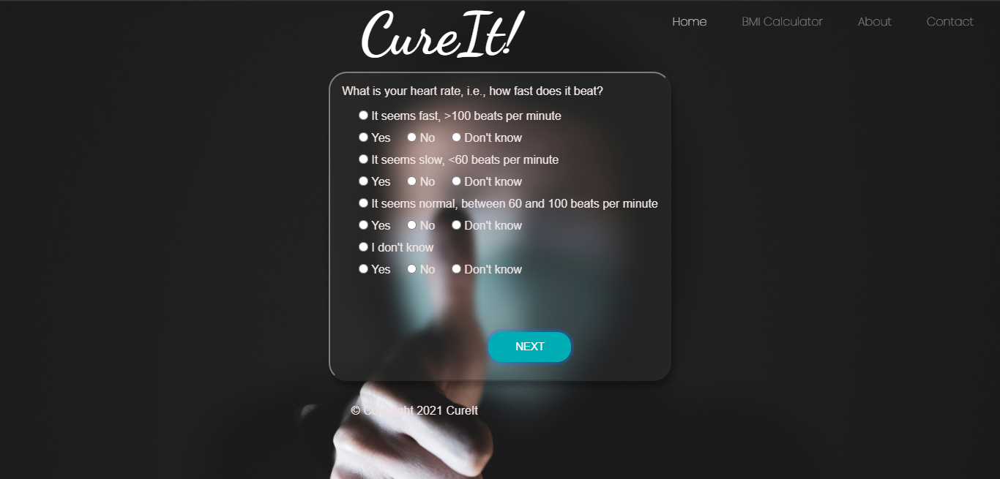
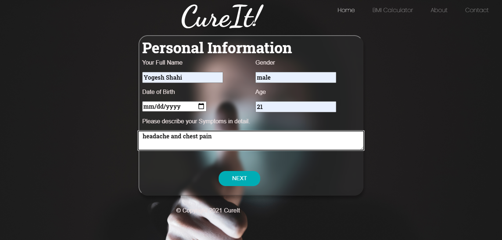
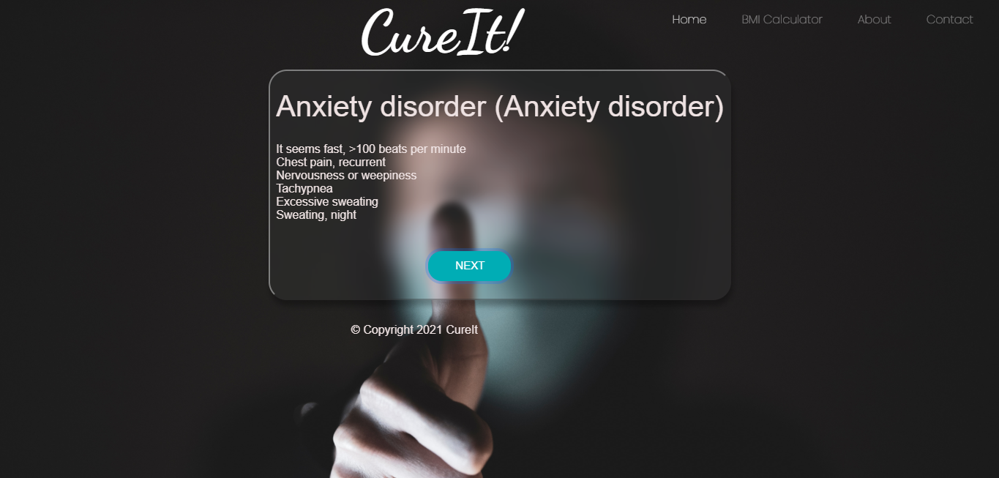

<!-- PROJECT LOGO -->
 

  <h1 align="center">Cure It</h1>

  

   It is a API based symptom Detector which will ask relevant question for futher treatment. IT tells probable symptom and disease.
  

  
 

 
 
 
 
 
 

